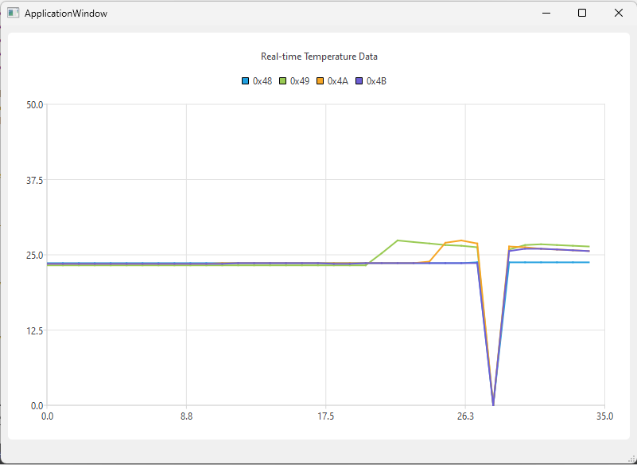

# 1. Folder: fullstack_emb_demo
# Temperature Sensor Data Logger
## Description
This project is designed to interface with a temperature sensor using the I2C protocol on STM32F407. It reads temperature data, formats the data into a JSON string, and transmits it over UART. 

### External Dependencies
```
extern "C" {
  #include "main.h"
  #include "i2c.h"
  #include "spi.h"
  #include "usart.h"
  #include "gpio.h"
}
```

### C++ Headers
Necessary C++ headers for the project, such for I2C device handling (I2CDevice.hpp), temperature sensing (TemperatureSensor.hpp), and the temperature sensor model (LM75.hpp).

```
#include "I2CDevice.hpp"
#include "TemperatureSensor.hpp"
#include "LM75.hpp"
```
### Main Function
The main() function is the entry point of the application. It follows these steps:

1. Calls HAL_Init() to initialize the HAL Library and then sets up system clock, GPIO, I2C, SPI, and USART peripherals with specific initialization functions. 
2. Creates an instance of TemperatureSensor, passing pointers to the I2C and UART handles (&hi2c1, &huart2). It then calls scanI2CDevices() to scan for connected I2C devices.
3. Main Loop: Continuously updates temperature readings, formats them into a JSON string, and sends this over UART. The loop then waits for 5 seconds (HAL_Delay(5000)) before repeating.

## Requirements
STM32F407 with I2C, SPI, USART, and GPIO capabilities.
HAL (Hardware Abstraction Layer) libraries.
I2C temperature sensor (LM75).
Development environment (STM32CubeIDE).

# 2. Folder: fullstack_emb_gui
# Temperature Visualization
## Description
C++ desktop application, developed with Qt framework, designed to serve as a graphical user interface (GUI) for the microcontroller-based temperature monitoring system described earlier. This GUI application interfaces with the microcontroller through a serial port to receive real-time temperature data and visualizes this data on a chart. <br><br>


### Constructor: ApplicationWindow
The constructor initializes the main components of the application:

1. Initializes the UI and sets up the main window.
2. Initializes the QSerialPort and QChart objects, setting up the serial port with a specified port name and baud rate, and connecting the readyRead signal of the serial port to the readSerialData slot to handle incoming data.
3. Sets up the chart view, including chart title, rendering hints, and making it the central widget of the main window.
4. Trys to open the serial port for reading and logs an error message if unsuccessful.

### Slot: readSerialData
This function is called whenever new data is available on the serial port. It:

1. Reads all available data from the serial port and parses it as a JSON document.
2. Checks if the JSON document contains an array and iterates over its elements, extracting the temperature data and sensor address.
3. Dynamically manages a map of QLineSeries objects, each representing a data series for a unique sensor. If a series for a sensor doesn't exist, it creates a new one and adds it to the chart.
4. Adds the temperature data to the appropriate series and increments a time index used for the x-axis of the chart.
5. Optionally adjusts the chart's axis ranges.

### Destructor: ~ApplicationWindow
Cleans up resources when the application window is closed. It ensures the serial port is closed and deletes the UI object.


## TO DO:
1. Obtain timestamps for data points and display them on the x-axis of the Qt application.
2. Add zooming and line (ON/OFF) toggling capabilities into the line chart functionality.

## License
MIT - Feel free to use and modify this code for your projects.